# AI Scoring Engine Build Plan

## Demo Flow (drives all architecture decisions)

```mermaid
flowchart LR
    subgraph before_demo [Before Demo - Setup]
        Seed["pnpm db:seed:queue\n14 patients seeded"]
        BatchScore["pnpm db:score\nAI scores all 14"]
        Seed --> BatchScore
    end

    subgraph on_stage [On Stage - Live]
        AppOpens["App loads\n14 patients ranked, scored,\ncontradictions visible"]
        NewPatient["Manually add 1 new patient"]
        LiveScore["AI scores live\n(judges watch)"]
        DetailView["Click into patient\nStreaming reasoning plays"]
        AppOpens --> NewPatient --> LiveScore --> DetailView
    end

    before_demo --> on_stage
```




- **14 pre-scored patients**: Batch script runs before demo, populates all AI fields in DB
- **1 live patient**: Entered on stage, goes through full AI scoring pipeline in real-time
- **Streaming reasoning**: Detail page streams clinical thinking live for judges

## Current State

- Backend queue APIs built and tested (queue, status, feedback, SSE stream)
- 14 patients seeded in `queue_patients` with rough estimate scores from scan script
- `aiSummary` is NULL for all patients; scores are estimates, not real AI output
- `/api/ai/reason` uses direct Anthropic SDK (no streaming, no structured output)
- Vercel AI SDK NOT installed. No `/api/ai/score` endpoint. No `zod` dependency
- **DB schema already has all needed fields** — no migration required

## Phase 1: SDK Setup

**Install:**

```bash
pnpm add ai @ai-sdk/google zod
```

**Replace `[src/lib/ai.ts](src/lib/ai.ts)`** — remove Anthropic SDK entirely, export Gemini only:

```typescript
import { google } from '@ai-sdk/google';
export const gemini = google('gemini-2.5-flash');
```

The `@anthropic-ai/sdk` package can be removed from `package.json` since nothing will use it.

**Prereq:** `GOOGLE_GENERATIVE_AI_API_KEY` must be in `.env.local`.

## Phase 2: Shared AI Helpers

**New file: `[src/lib/ai-helpers.ts](src/lib/ai-helpers.ts)`**

Core functions used by both the batch script and the live scoring endpoint:

- `fetchPatientContext(hadmId)` — queries labs (most recent 50), prescriptions, diagnoses (with ICD-9 titles), and prior admissions for the same `subjectId` from the DB
- `buildScoringSystemPrompt(rlExamples?)` — returns the system prompt with:
  - 6 contradiction detection rules (Metformin+creatinine, Metformin+CKD, ACE+K+, Warfarin+INR, NSAID+CKD, NSAID+CHF)
  - Severity scoring rubric (critical ICD-9 codes, lab thresholds, contradiction weights)
  - Confidence scoring guidance (data richness)
  - Optional RL preference examples from recent `ScoringFeedback`
- `buildPatientPrompt(context)` — formats patient data into the user message
- `ScoringResultSchema` — Zod schema for structured output
- `fetchRLPreferences()` — gets 5 most recent ScoringFeedback records with notes

**Zod schema:**

```typescript
const ScoringResultSchema = z.object({
  severityScore: z.number().min(0).max(100),
  confidenceScore: z.number().min(0).max(100),
  contradictions: z.array(z.object({
    severity: z.enum(["CRITICAL", "HIGH", "MODERATE"]),
    title: z.string(),
    description: z.string(),
    drug: z.string(),
    labOrDiagnosis: z.string(),
    action: z.string(),
  })),
  summary: z.string(),
  recommendedActions: z.array(z.string()),
});
```

## Phase 3: Batch Scoring Script (Pre-Demo)

**New file: `[scripts/score-patients.ts](scripts/score-patients.ts)`**

- Runs standalone via `pnpm db:score` (add to package.json scripts)
- Loads all `queue_patients` from DB
- For each patient: calls `fetchPatientContext` + `generateText` with `Output.object()` using the Zod schema
- Writes `severityScore`, `confidenceScore`, `contradictions` (JSON), `aiSummary`, `scoredAt` to each `queue_patients` row
- Re-sorts `queuePosition` by severity descending after all patients are scored
- Prints a summary table showing all patients with their scores, contradiction counts, and summaries
- Sequential processing (one patient at a time) to stay within rate limits and keep API usage low

**This is the "pre-demo setup" step.** After running `pnpm db:seed:queue && pnpm db:score`, all 14 patients have real AI-generated scores and summaries.

## Phase 4: Live Scoring Endpoint (On-Stage)

**New file: `[src/app/api/ai/score/route.ts](src/app/api/ai/score/route.ts)`**

- `POST /api/ai/score` with body `{ hadmId: number }`
- Uses the same `fetchPatientContext` + `generateText` + `Output.object()` as the batch script
- Includes RL preference injection (`fetchRLPreferences()`) so doctor overrides influence scoring
- Writes results to `queue_patients` row
- Assigns `queuePosition` based on severity relative to existing queue
- Emits SSE `queue_updated` event so nurse view updates instantly
- Returns the scoring result in the response

This is what fires when the ONE new patient is entered during the live demo.

## Phase 5: Streaming Reasoning (Detail Page)

**Replace `[src/app/api/ai/reason/route.ts](src/app/api/ai/reason/route.ts)`**

- Uses Vercel AI SDK `streamText` with Gemini
- Fetches full patient context from DB
- System prompt guides step-by-step clinical reasoning:
  1. Review chief complaint and admission diagnosis
  2. Check active medications against lab values
  3. Flag any contradictions with specific values
  4. Evaluate severity based on clinical picture
  5. Recommend actions
- Returns standard AI SDK streaming response
- This is the "live thinking" display when a doctor clicks into any patient

**Separate from scoring** — scoring populates the DB (numbers, summary, contradictions). Streaming reasoning is the narrative clinical thinking shown on the detail page.

## Phase 6: Types Update

**Update `[src/types/index.ts](src/types/index.ts)`:**

- Add `ScoringResult` interface matching the Zod schema
- Add `PatientContext` type for fetched clinical data
- Update `Contradiction` type to include `"MODERATE"` severity and `labOrDiagnosis` field

## Phase 7: Test Script

**New file: `[scripts/test-ai-scoring.ts](scripts/test-ai-scoring.ts)`**

Functional tests against the running dev server:

1. **Single-patient scoring** — POST `/api/ai/score` with hadm_id 148037 (Metformin + Creatinine 1.6 + Warfarin + INR 6.9). Verify:
  - Correct response shape
  - severityScore > 70
  - At least 1 contradiction detected
  - aiSummary is non-empty string
2. **DB persistence** — GET `/api/queue`, verify the scored patient has populated AI fields
3. **Streaming reasoning** — POST `/api/ai/reason`, read stream chunks, confirm clinical text arrives
4. **Quality check** — Print the full scoring result for manual clinical review

## Files Changed/Created


| File                             | Action   | Purpose                                                                              |
| -------------------------------- | -------- | ------------------------------------------------------------------------------------ |
| `package.json`                   | Modified | Add `ai`, `@ai-sdk/google`, `zod`; remove `@anthropic-ai/sdk`; add `db:score` script |
| `src/lib/ai.ts`                  | Replaced | Remove Anthropic, export Gemini provider only                                        |
| `src/lib/ai-helpers.ts`          | **New**  | Shared: patient context, prompt building, Zod schema, RL injection                   |
| `src/app/api/ai/score/route.ts`  | **New**  | Live single-patient scoring endpoint                                                 |
| `src/app/api/ai/reason/route.ts` | Replaced | Streaming reasoning with Vercel AI SDK                                               |
| `src/types/index.ts`             | Modified | Add ScoringResult, PatientContext types                                              |
| `scripts/score-patients.ts`      | **New**  | Batch pre-scoring script for demo setup                                              |
| `scripts/test-ai-scoring.ts`     | **New**  | Functional test script                                                               |


## Key Prereqs

1. `GOOGLE_GENERATIVE_AI_API_KEY` must be in `.env.local`
2. DB must be seeded (`pnpm db:seed && pnpm db:seed:queue`)
3. Dev server running for test script (`pnpm dev`)

