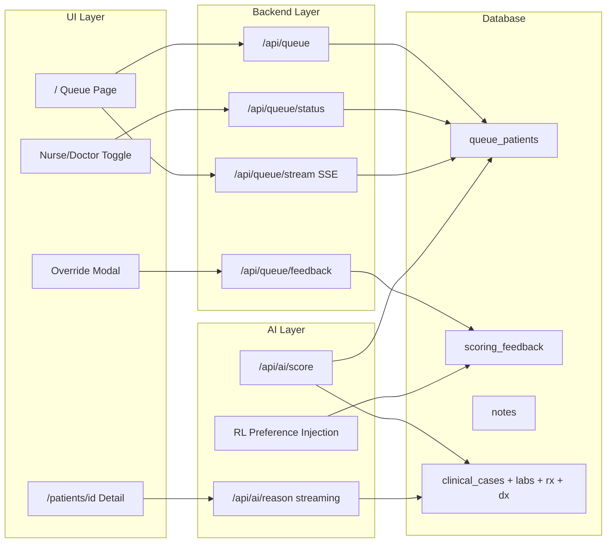

# Clinical Reasoning Engine — Build Plan

## Current State

The app is a **patient browser** for 2000 MIMIC records. The home page (`[src/app/page.tsx](src/app/page.tsx)`) reads `clinical_cases` via `/api/patients`, not `queue_patients`. The detail page (`[src/app/patients/[hadm_id]/page.tsx](src/app/patients/[hadm_id]/page.tsx)`) renders static data. The AI route (`[src/app/api/ai/reason/route.ts](src/app/api/ai/reason/route.ts)`) uses the direct Anthropic SDK (no streaming, no tool use, no scoring). **Vercel AI SDK is not installed.** The `queue_patients` table has 14 seeded rows that nothing reads yet.

## Architecture Overview

