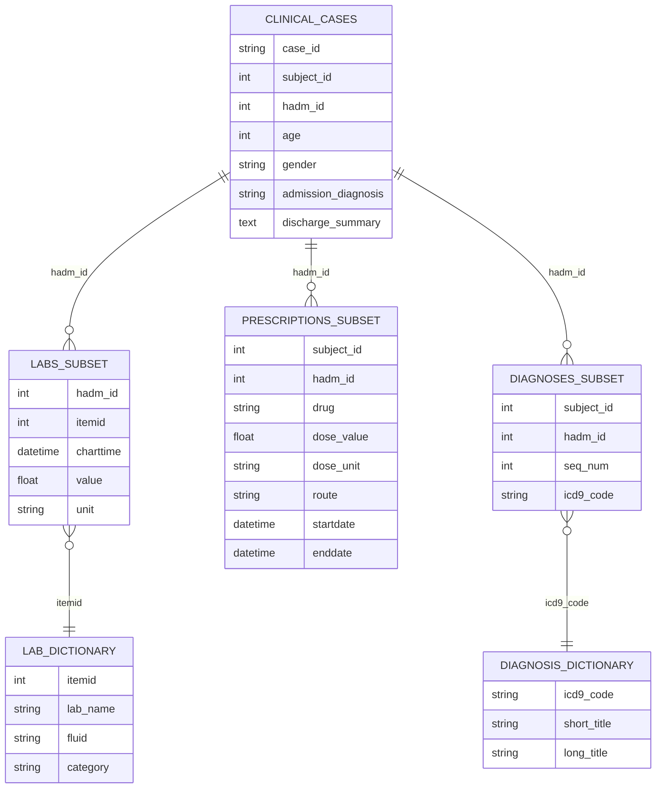

# Clinical AI Hackathon Dataset

This dataset contains de-identified clinical data prepared for the Clinical AI Hackathon. It is derived from the MIMIC clinical database and organized into a structured format suitable for machine learning, large language models, and clinical AI research.

The dataset is designed to support the development of AI systems that can interpret clinical documentation, analyze patient context, and assist healthcare workflows.

## Dataset Overview

The dataset contains approximately **2000 hospital admission cases** with associated:

- discharge summary clinical notes
- laboratory measurements
- medication prescriptions
- diagnosis codes

Each case represents a **single hospital admission**.

The dataset can support a range of clinical AI tasks, including:

- clinical note summarization
- structured information extraction
- clinical reasoning
- retrieval-augmented generation (RAG)
- case similarity search
- decision support prototyping

## Files

The dataset consists of the following files:

- `clinical_cases.csv.gz`
- `labs_subset.csv.gz`
- `prescriptions_subset.csv.gz`
- `diagnoses_subset.csv.gz`
- `lab_dictionary.csv.gz`
- `diagnosis_dictionary.csv.gz`

## Table Descriptions

### `clinical_cases.csv.gz`

One row per hospital admission.

| column | description |
|---|---|
| case_id | unique identifier for the case |
| subject_id | anonymized patient identifier |
| hadm_id | hospital admission identifier |
| age | patient age at admission |
| gender | patient sex |
| admission_diagnosis | diagnosis recorded at admission |
| discharge_summary | discharge summary clinical note |

### `labs_subset.csv.gz`

Laboratory measurements associated with admissions.

| column | description |
|---|---|
| hadm_id | hospital admission identifier |
| itemid | lab test identifier |
| charttime | measurement timestamp |
| value | lab result value |
| unit | measurement unit |

### `lab_dictionary.csv.gz`

Dictionary mapping lab identifiers to test names.

| column | description |
|---|---|
| itemid | lab identifier |
| lab_name | name of laboratory test |
| fluid | specimen type |
| category | laboratory category |

### `prescriptions_subset.csv.gz`

Medication prescriptions recorded during hospital admissions.

| column | description |
|---|---|
| subject_id | patient identifier |
| hadm_id | hospital admission identifier |
| drug | medication name |
| dose_value | dosage value |
| dose_unit | dosage unit |
| route | route of administration |
| startdate | prescription start date |
| enddate | prescription end date |

### `diagnoses_subset.csv.gz`

Diagnosis codes assigned during hospital admissions.

| column | description |
|---|---|
| subject_id | patient identifier |
| hadm_id | hospital admission identifier |
| seq_num | diagnosis order |
| icd9_code | ICD-9 diagnosis code |

### `diagnosis_dictionary.csv.gz`

Dictionary for ICD-9 diagnosis codes.

| column | description |
|---|---|
| icd9_code | ICD-9 diagnosis code |
| short_title | short diagnosis description |
| long_title | full diagnosis description |


## Example Usage

Load individual tables from the dataset repository.

```python
from huggingface_hub import hf_hub_download
import pandas as pd

repo_id = "bavehackathon/2026-healthcare-ai"

clinical_cases = pd.read_csv(
    hf_hub_download(repo_id=repo_id, filename="clinical_cases.csv.gz", repo_type="dataset")
)

labs = pd.read_csv(
    hf_hub_download(repo_id=repo_id, filename="labs_subset.csv.gz", repo_type="dataset")
)
```

## Dataset Schema

The dataset follows a relational structure where each hospital admission (`hadm_id`) acts as the primary key linking multiple tables.

